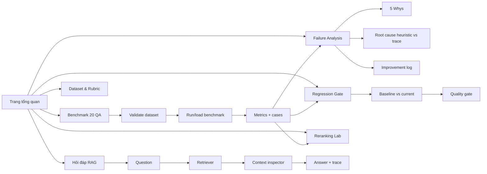

# Plan — Demo UI tiếng Việt cho AI Evaluation & Benchmarking Pipeline

> **Mục tiêu:** biến pipeline Lab 14 thành một demo local đẹp, dễ dùng bằng tiếng Việt và có thể
> trình diễn trực tiếp toàn bộ luồng RAG → Evaluation → Benchmark → Failure Analysis → Regression
> → Reranking.
>
> **Phạm vi:** demo offline-first, không expose API key, không sửa logic metric lõi nếu không có
> test chứng minh cần thiết.
>
> **Kiến trúc đã triển khai:** HTML/CSS/JavaScript thuần + Python `http.server` làm backend local.
> Cách này không cần cài thêm framework UI, khởi động nhanh bằng một lệnh, chạy offline ổn định và
> vẫn gọi trực tiếp các service Python hiện có qua các API JSON nhỏ.

---

## 1. Audit hiện trạng — source of truth trước khi build

### 1.1 Những luồng đã hoạt động

| Luồng | Bằng chứng hiện tại | Trạng thái |
|---|---|---|
| Load corpus và BM25 retrieval | `DomainAssistant.from_corpus()` load đủ corpus, smoke test trả về 5 chunks | PASS |
| Sinh answer có trace | `answer_with_trace()` trả answer + retrieved chunks | PASS với MockGenerator; provider thật cần kiểm tra riêng |
| Golden dataset validation | `validate_golden_dataset.py` báo PASS, 20 QA, đúng 5/7/5/3, coverage 10/10 | PASS |
| Benchmark offline | `evaluate_answers.py` nối golden + actual vào `RAGASEvaluator`/`BenchmarkRunner` | PASS, 20 results |
| Answer metrics | Faithfulness, Relevance, Completeness có trong core và full test | PASS |
| Retrieval metrics | Context Recall/Precision có trong report và wiring test | PASS |
| Failure taxonomy | `FailureAnalyzer` có categorize/root cause/suggestions/improvement log | PASS |
| Regression gate | `run_regression()` hoạt động khi có baseline list | PASS; artifact hiện tại chưa có baseline |
| Reranking bonus | `rerank_by_overlap()` và bonus results đã có | PASS |
| CP4 audit | `artifacts/cp4_audit.json/.md` có clusters, top 3, traceability 20 rows | PASS |
| Static dashboard | `generate_dashboard.py` sinh `artifacts/dashboard.html`, có chart/search/filter | PASS nhưng chỉ đọc artifact |

### 1.2 Những điểm chưa đủ để gọi là một demo hoàn chỉnh

1. Chưa có một entrypoint UI duy nhất để người xem bấm và chạy các flow.
2. `artifacts/dashboard.html` đang là dashboard tĩnh, nhãn tiếng Anh, chưa chạy live query,
   validator, benchmark, failure analysis hoặc regression từ giao diện.
3. Dashboard dùng Chart.js/font từ CDN; khi demo offline có thể thiếu chart hoặc font.
4. `evaluate_answers.py` hiện import `template.py`, trong khi test cuối ưu tiên
   `solution/solution.py`. Hai file hiện cùng hash, nhưng UI phải dùng một core loader duy nhất để
   tránh divergence sau này.
5. `actual_answers.json` hiện ghi `model=mock-offline-generator`. Đây là trạng thái an toàn để
   demo không cần API, nhưng UI phải hiển thị rõ badge “Offline mock”, không được gọi đó là LLM thật.
6. Không có baseline artifact committed nên regression phải hiển thị `CHƯA ĐÁNH GIÁ`, không được
   biến thành `PASS` giả.
7. Human review/online monitoring chưa phải flow code hoàn chỉnh; demo chỉ nên trình diễn phần
   annotation/calibration ở dạng review panel, không tuyên bố đã có production online evaluation.

### 1.3 Smoke contract cần giữ nguyên

- Full suite hiện tại: **42 passed**.
- Golden validator hiện tại: **PASS**.
- Không đổi công thức `overall_score()` và không đưa retrieval metrics vào Overall.
- Không đọc `expected_answer` hoặc gold contexts khi live assistant đang sinh answer.
- Không commit `.env`, API key hoặc dữ liệu nhạy cảm.

---

## 2. UX concept — “Northstar Eval Lab”

### 2.1 Nguyên tắc trải nghiệm

- Toàn bộ nhãn, tooltip, trạng thái, lỗi và hướng dẫn demo dùng tiếng Việt.
- Người xem luôn biết đang ở bước nào: `1. Dữ liệu → 2. RAG → 3. Chấm điểm → 4. Phân tích`.
- Mỗi kết quả có trạng thái chữ và icon, không chỉ dùng màu:
  - `Đạt` — xanh;
  - `Cảnh báo` — vàng;
  - `Chặn / Không đạt` — đỏ;
  - `Chưa đánh giá` — xám.
- Không hiển thị secret, không dump toàn bộ prompt hệ thống trong UI.
- Có hai chế độ:
  - **Trình diễn có hướng dẫn:** dữ liệu/artifact có sẵn, nút “Chạy bước tiếp theo”.
  - **Khám phá:** người dùng tự nhập question, chọn case và filter.

### 2.2 Visual direction

- Nền navy tối, card glass nhẹ, accent indigo/cyan; typography rõ trên màn hình projector.
- KPI card lớn cho Pass rate, Faithfulness, Relevance, Completeness, Context Recall và
  Context Precision.
- Chất lượng luôn có explanation cạnh số, ví dụ: “Retrieval tốt nhưng answer-side thấp”.
- Table có sticky header, search, filter difficulty/failure type và row detail drawer.
- Chart tối thiểu: metric radar, failure distribution, score theo difficulty, before/after reranking.
- Responsive cho laptop và màn hình demo; không phụ thuộc CDN để demo vẫn chạy khi mất mạng.

---

## 3. Information architecture của demo



### 3.1 Trang 1 — Tổng quan / Demo control center

Hiển thị:

- Tên lab, corpus ID, thời điểm artifact, provider/model badge.
- KPI cards: tổng case, pass rate, avg Overall, avg Faithfulness, avg Relevance, avg
  Completeness, avg Context Recall, avg Context Precision.
- Quality gate tổng hợp:
  - Dataset gate: validator status.
  - Answer-quality gate: pass rate/threshold.
  - Safety gate: số adversarial cases và safety flags.
  - Regression gate: `PASS`, `FAIL` hoặc `CHƯA ĐÁNH GIÁ` nếu chưa có baseline.
- Nút hành động:
  - `Kiểm tra dataset`;
  - `Nạp lại artifacts`;
  - `Chạy benchmark offline`;
  - `Bắt đầu demo có hướng dẫn`.

### 3.2 Trang 2 — Hỏi đáp RAG / Live trace

Input và controls:

- Text area “Nhập câu hỏi tiếng Việt hoặc tiếng Anh”.
- Select case mẫu: E01, M07, H04, A01, A02, A03.
- Slider `top_k` 1–10.
- Select provider: `Mock offline` mặc định; `Provider thật` chỉ bật khi key hợp lệ.
- Checkbox “Hiển thị chi tiết retrieval”.

Kết quả phải trình bày theo thứ tự:

1. Question và thời gian xử lý.
2. Answer cuối cùng.
3. Badge `Provider: offline mock / Gemini / OpenAI`.
4. Danh sách retrieved chunks theo rank, source document, chunk ID và score.
5. Highlight lý do: “Có evidence”, “Thiếu evidence”, “Out-of-scope”, “Có nguy cơ refusal”.
6. Nút `Chấm riêng answer này` để chạy ba answer metrics trên trace hiện tại nếu có gold case.

Guardrail UI:

- Không cho UI in system prompt/API key.
- Nếu provider thật fallback về mock, hiện cảnh báo rõ: “API call thất bại — đang dùng offline
  fallback”.
- Live query không được tự ý ghi đè `actual_answers.json`; chỉ có nút export rõ ràng.

### 3.3 Trang 3 — Benchmark / Evaluation explorer

- Nút `Validate golden dataset` gọi validator service và hiện log tóm tắt.
- Nút `Chạy benchmark từ actual artifact` gọi core dùng `solution/solution.py`.
- Bảng 20 cases gồm ID, question, difficulty, 5 metrics, Overall, Passed, failure type.
- Filter:
  - difficulty;
  - failure type;
  - Overall dưới threshold;
  - chỉ xem adversarial;
  - search theo question/source document.
- Khi click một row, mở detail:
  - expected answer;
  - actual answer;
  - gold evidence;
  - retrieved evidence;
  - metric breakdown;
  - nhận xét heuristic.
- Chart:
  - score theo difficulty;
  - metric radar;
  - failure distribution.

### 3.4 Trang 4 — Failure Analysis / 5 Whys

- Mặc định mở E01, E02, E03 vì đây là 3 case thấp nhất hiện tại.
- Mỗi case có timeline 5 Whys:
  - Triệu chứng;
  - Why 1–5;
  - root cause hành động được;
  - fix đề xuất;
  - metric dùng để verify fix.
- So sánh hai cột:
  - `find_root_cause()` của core;
  - `Root cause từ trace` trong CP4.
- Hiển thị cảnh báo khi heuristic không khớp trace, tránh trình diễn sai rằng mọi lỗi là retrieval.
- Cluster cards: grounding/generation, safety review, intent/routing.
- Improvement log có status `Open`, `In progress`, `Verified` và metric target.

### 3.5 Trang 5 — Regression Gate

- Cho phép chọn:
  - current results: artifact hiện tại hoặc benchmark vừa chạy;
  - baseline: file JSON upload hoặc artifact snapshot đã lưu.
- Threshold mặc định `0.05`, giải thích bằng tooltip.
- So sánh Faithfulness, Relevance, Completeness; hiển thị delta từng metric.
- Kết luận rõ:
  - `PASS`: không metric nào giảm quá threshold;
  - `FAIL`: liệt kê metric/case giảm;
  - `CHƯA ĐÁNH GIÁ`: chưa có baseline.
- Có toggle `Safety override`: một adversarial/safety failure nghiêm trọng vẫn chặn dù average
  score không giảm.
- Nút `Lưu current làm baseline` phải yêu cầu xác nhận và lưu vào `artifacts/baselines/` với
  timestamp, không ghi đè baseline cũ.

### 3.6 Trang 6 — Reranking Lab

- Chọn tối thiểu 5 traces, mặc định dùng các case trong `bonus_results.json`.
- Hiển thị trước/sau:
  - thứ tự chunks;
  - Context Precision;
  - Context Recall;
  - delta precision.
- Assertion trực quan:
  - union chunk không đổi;
  - Context Recall không đổi;
  - reranking chỉ tác động thứ tự/precision.
- Cho phép thử một question khác nhưng đánh dấu rõ đó là exploratory run, không tự đưa vào bonus
  artifact.

### 3.7 Trang 7 — Dataset, Rubric & Provenance

- Dataset summary: 20 QA, difficulty distribution, 10/10 document coverage.
- Evidence provenance table: source document, chunk count, case IDs.
- Rubric 5 dimensions và safety override từ `exercises.md`.
- Artifact provenance: generated_at, model/provider, top_k, prompt version.
- Cảnh báo khi model là `mock-offline-generator` hoặc khi artifact cũ hơn dataset.

---

## 4. Kiến trúc code đề xuất

### 4.1 Files đã triển khai

```text
serve_demo.py                  # HTTP backend + API orchestration
demo_app.html                  # UI tiếng Việt responsive, không phụ thuộc CDN
plan_demo_ui_vietnamese.md     # audit, UX và acceptance criteria
artifacts/baselines/           # baseline tùy chọn cho regression
```

### 4.2 Source of truth cho evaluation core

Demo phải load `solution/solution.py` làm core chính. Dùng một helper import an toàn hoặc refactor
module loader để `evaluate_answers.py` và demo cùng trỏ về core hoàn thiện; không copy-paste metric
logic vào UI. Nếu cần thay đổi `evaluate_answers.py`, phải chạy lại full suite và giữ nguyên output.

### 4.3 Service API nội bộ

Các hàm nên có contract nhỏ, dễ test:

```python
load_demo_state() -> DemoState
validate_golden() -> ValidationView
run_live_query(question, top_k, provider) -> TraceView
load_benchmark() -> BenchmarkView
run_benchmark(actual_path) -> BenchmarkView
get_failure_detail(case_id) -> FailureDetail
run_regression(current, baseline, threshold) -> RegressionView
run_reranking(case_ids) -> RerankingView
export_demo_snapshot(state, output_path) -> Path
```

Backend trả JSON thuần; UI chỉ render và gọi API. Các endpoint hiện có là `/api/state`,
`/api/query`, `/api/validate`, `/api/benchmark`, `/api/reranking`, `/api/regression` và
`/api/baseline`.

---

## 5. Roadmap thực hiện theo phase

### Phase 0 — Contract & preflight

- [x] Chọn kiến trúc Python stdlib + HTML/CSS/JavaScript, không cần dependency UI mới.
- [x] Kiểm tra `solution/solution.py` và `template.py` không lệch hash; full suite vẫn PASS.
  chạy lại tests.
- [x] Định nghĩa các trạng thái `PASS/WARN/BLOCK/NOT_EVALUATED` trong UI.
- [x] Artifact read-only mặc định; chỉ ghi baseline sau nút bấm rõ ràng.

### Phase 1 — Service layer

- [x] Loader cho golden, actual, benchmark, CP4 audit và bonus results.
- [x] `validate_golden()` và map output validator sang tiếng Việt.
- [x] `run_live_query()` dùng grounded offline generator mặc định, có provider badge.
- [x] `run_benchmark()` dùng core hoàn thiện và trả 20 results.
- [x] `get_failure_detail()` nối question/actual/retrieved và 5 Whys.
- [x] Regression service hỗ trợ baseline file và trạng thái chưa có baseline.
- [x] Reranking service xác nhận union coverage bất biến.

### Phase 2 — UI shell & visual system

- [x] Sidebar navigation bằng tiếng Việt.
- [x] Theme navy/indigo/cyan, KPI card, status badge, empty state, error state.
- [x] Header có corpus ID, provider và nút “Nạp lại dữ liệu”.
- [x] Footer “Offline demo — không hiển thị API key”.
- [x] UI không phụ thuộc chart/font CDN.

### Phase 3 — Build 7 pages

- [x] Tổng quan/control center.
- [x] Hỏi đáp RAG/live trace.
- [x] Benchmark explorer.
- [x] Failure Analysis/5 Whys.
- [x] Regression Gate.
- [x] Reranking Lab.
- [x] Dataset/Rubric/Provenance.

### Phase 4 — Guided demo mode

- [x] Thêm flow “Demo trong 5 phút” với progress stepper.
- [x] Preset scenario:
  1. Validate dataset;
  2. Hỏi E01 và mở retrieved chunks;
  3. Mở benchmark và top 3 failures;
  4. Mở 5 Whys E01;
  5. Chạy regression không có baseline để trình diễn `CHƯA ĐÁNH GIÁ`;
  6. Mở reranking before/after;
  7. Lưu baseline demo và chạy lại regression để thấy `PASS`.
- [x] Mỗi bước có câu nói demo ngắn để người trình bày không bị lạc flow.

### Phase 5 — Verification

- [x] `python -m pytest tests/ -v` đạt 42 passed.
- [x] `python validate_golden_dataset.py` báo PASS.
- [x] Chạy UI bằng offline generator và click kiểm tra 7 page.
- [x] Kiểm tra E01, benchmark, 5 Whys, baseline chưa có và reranking.
- [x] Kiểm tra không có secret trong log/UI/diff.
- [ ] Bổ sung test service độc lập và quay video evidence demo.

### Phase 6 — Handoff

- [x] Cập nhật README với lệnh chạy:

  ```powershell
  python serve_demo.py
  ```

- [x] Ghi rõ demo offline dùng `mock-offline-generator`; provider thật chỉ là optional.
- [ ] Commit source UI và README; không commit `.env`, key hoặc baseline có dữ liệu
  nhạy cảm.
- [x] Chạy lại `git diff --check`, `pytest`, validator trước commit/push.

---

## 6. Acceptance criteria — Definition of Done

Demo chỉ được xem là hoàn chỉnh khi:

- [x] Khởi động bằng một lệnh và giao diện tiếng Việt hiển thị đẹp trên laptop/projector.
- [x] Người xem chạy được live RAG query và nhìn thấy answer + retrieved evidence.
- [x] Người xem chạy/nạp được benchmark 20 QA, xem đủ metrics và filter/detail từng case.
- [x] Người xem mở được 3 case thấp nhất và xem 5 Whys/root cause/fix.
- [x] Người xem chạy được regression với baseline và thấy đúng ba trạng thái PASS/FAIL/CHƯA ĐÁNH GIÁ.
- [x] Người xem so sánh được reranking trước/sau và thấy Recall không đổi.
- [x] Người xem xem được dataset distribution, evidence provenance và rubric.
- [x] UI phân biệt rõ mock offline với provider thật.
- [x] UI không làm thay đổi artifact gốc khi chỉ xem/demo; baseline chỉ ghi sau nút bấm.
- [x] Full test và golden validator vẫn PASS sau khi thêm demo.

---

## 7. Kịch bản demo đề xuất cho buổi trình bày

| Thời lượng | Thao tác | Thông điệp cần nói |
|---:|---|---|
| 30 giây | Tổng quan | Pipeline đo chất lượng theo cả answer và retrieval, không chỉ pass rate |
| 60 giây | Hỏi E01 | Cho thấy retriever lấy đúng evidence và trace giúp giải thích answer |
| 60 giây | Benchmark | 20 QA, 5 metrics, failure taxonomy và aggregate report |
| 90 giây | Failure E01 | Recall/Precision tốt nhưng Faithfulness thấp: ưu tiên kiểm tra generation/guardrail |
| 45 giây | Regression | Không có baseline thì gate phải nói “chưa đánh giá”, không giả mạo PASS |
| 45 giây | Reranking | Đổi thứ tự chunk tăng Precision nhưng không đổi union Recall |
| 30 giây | Dataset/Rubric | Golden evidence, safety cases và human calibration làm evaluation đáng tin hơn |

**Kết luận demo:** hệ thống không chỉ trả lời; nó ghi lại evidence, đo được chất lượng, giải thích
được failure và biến kết quả thành quyết định quality gate có thể lặp lại.
